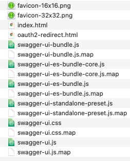
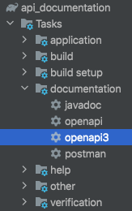
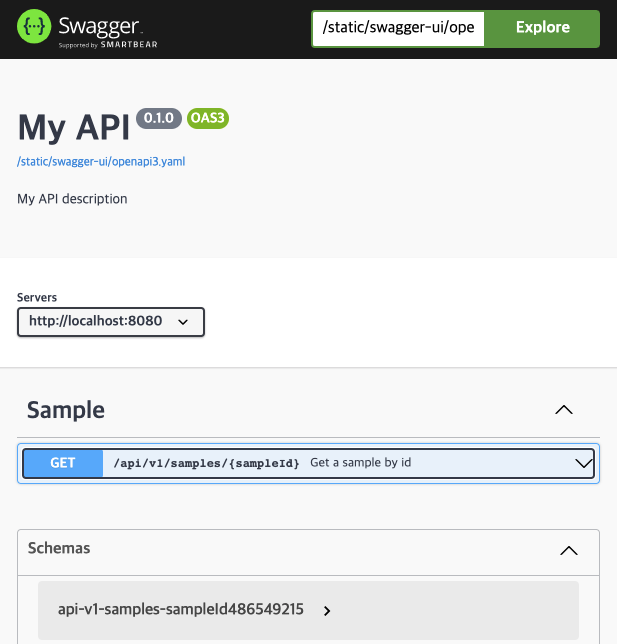
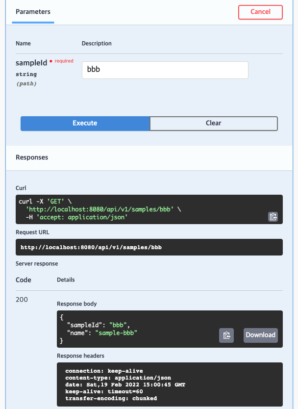

# 더욱 효과적인 Restful API 문서화
API 서버를 개발하게 되면 App, Frontend 그리고 동료 백엔드 개발자와 API 형상을 공유하고 편하게 테스트할 수 있는 환경을 제공해주는 것이 협업의 첫 걸음이라고 할 수 있습니다. 
Spring 기반 실무에선 Swagger나 REST Docs를 많이 사용하는데 각각 장점과 단점이 분명하게 있는데요. 본 글에서는 Swagger와 REST Docs의 장점만을 뽑아낸 OpenApi Spec.(OAS) 기반의 API 문서화 방법을 공유드리고자 합니다.
 
## 1. API 문서화 도구
### 1.1. Swagger
Swagger는 Controller에 몇 가지의 Annotation을 달기만 해도 API 문서가 만들어지는 편리함이 있지만 Test를 강제하지는 않기에 문서의 신뢰도를 높게 유지하기 어려운 문제가 있습니다.
그럼에도 문서가 워낙 예쁘고 테스트를 돌리지 않아도 되는 간편함이 있어 많이 사용되고 있니다.

| 장점 | 단점 |
|---|---|
| 예쁜 문서 | 어노테이션으로 소스코드가 복잡해짐 |
| API Test 기능 지원| 높지 않은 신뢰도(테스트 X)  |

### 1.2. Spring REST Docs
REST Docs는 Integration 테스트를 작성해서 통과해야만 문서가 작성되므로 문서의 신뢰도가 높게 유지된다는 장점이 있습니다. Swagger와 다르게 소스코드에 변경을 주지 않아 비즈니스 로직과 테스트케이스를 분리하는 장점이 있고 테스트를 강제하므로 유지보수에도 도움을 줍니다.
반면 문서가 Swagger에 비해 덜(?) 예쁘고 API Test를 지원하지는 않는 단점이 있습니다.

| 장점 | 단점 |
|---|---|
| 테스트 기반의 높은 신뢰도 | 문서가 예쁘지 않음 |
| 소스코드에 영향 없음 | API Test 기능 미지원 |

## 2. OpenApi Specification(OAS) 기반 API 문서화 
Swagger 팀이 SmartBear에 합류하면서 Swagger Spec.이 OpenApi Spec.으로 명칭이 바뀌어 오늘날에는 RESTful API 스펙에 대한 사실상의 표준으로서 활용되고 있다고 합니다.
Swagger-UI는 이 OAS 파일을 해석하여 API 스펙을 시각화해줍니다. 또한 Postman, Paw 같은 REST Clients들도 OAS를 지원하고 있어 OAS의 활용도가 무척 다양한 것을 알 수 있습니다.

### 2.1. REST Docs API specification Integration
REST Docs와 Swagger의 장점을 어떻게 합칠 수 있을까요? 운이 좋게도 독일 기업 epages에서 Spring REST Docs를 연동하여 [OAS 파일을 만들어주는 오픈소스(restdocs-api-spec)](https://github.com/ePages-de/restdocs-api-spec "")를 제공하고 있습니다. 이 오픈소스를 이용해서 OAS 파일을 생성하고 Swagger-UI로 띄우면 되는 것입니다.

### 2.2. 구현
구현 순서는 다음과 같습니다.
1. Swagger-UI standalone, Static Routing 셋팅
2. restdocs-api/spec을 이용한 OAS 파일을 생성하는 빌드 환경 구축
3. 생성된 OAS 파일을 swagger 디렉토리로 복사하는 스크립트 작성(copyOasToSwagger)
4. MockMvc REST Docs Test 코드 작성

구현 작업물은 프로젝트 소스코드로 남겨놓았으니 참고해주세요. :)

#### 2.2.1. Swagger-UI standalone, Static Routing 셋팅
Swagger-UI gradle 의존성은 불필요하며 standalone (HTML/CSS/JS) 파일들만 있으면 됩니다.

##### 2.2.1.1. [Swagger UI Installation](https://swagger.io/docs/open-source-tools/swagger-ui/usage/installation/ "")
'Static files without HTTP or HTML' 부분에서 latest release를 다운 받아 /dist 디렉토리만 복사해줍니다. 
  * 

##### 2.2.1.2. Static Routing 셋팅
WebMvcConfigurer의 addResourceHandlers() 메서드를 구현합니다.

[Static Routing Configuration](src/main/kotlin/com/traeper/api_documentation/configuration/StaticRoutingConfiguration.kt "")

##### 2.2.1.3. Swagger file 수정 
* index.html
  * swagger-ui.html으로 이름 변경
  * 내부 js, css 경로를 static routing으로 적용
  * SwaggerUIBundle 경로는 생성될 yaml 파일의 경로로 입력
* 불필요한 파일 삭제
  * oauth2-redirect.html
  * swagger-ui.js
  * swagger-ui-es-bundle-core.js
  * swagger-ui-es-bundle.js

#### 2.2.2. ePages-de/restdocs-api/spec을 이용한 OAS 출력
Spring REST Docs의 extension을 포함하는 **restdocs-api-spec**과 MockMvc wrapper를 제공하는 **restdocs-api-spec-mockmvc**를 이용해서 OAS 파일을 생성하고자 합니다.
RestAssured도 지원되니 필요하신 분은 restdocs-api-spec-restassured를 사용하셔도 됩니다.
build tool은 gradle로 진행하겠습니다.

build.gradle.kts 파일에 아래처럼 plugins와 dependency를 추가해주면 사용할 수 있습니다. 깃헙에 [legacy plugin 예시](https://github.com/ePages-de/restdocs-api-spec#gradle "")도 함께 제공되니 편한 것을 이용해서 환경을 잡아주면 됩니다.
openapi, openapi3, postman 등 다양한 output format이 제공되고 커스터마이징할 수 있는데 본 포스팅에서는 swagger 연동을 위해 openapi3 설정을 커스터마이징해보곘습니다.

OAS 파일 기본 생성 경로는 `/build/api-spec` 입니다.

```kotlin
plugins {
    id("com.epages.restdocs-api-spec") version "0.15.3"
}

repositories {
    mavenCentral()
}

dependencies {
    testImplementation("com.epages:restdocs-api-spec-mockmvc:0.15.3")
}

openapi3 {
    this.setServer("https://localhost:8080") // list로 넣을 수 있어 각종 환경의 URL들을 넣을 수 있음!
    title = "My API"
    description = "My API description"
    version = "0.1.0"
    format = "yaml" // or json
}
```

* gradle Tasks - documentation에 openapi, openapi3, postman Task가 기본적으로 추가된 모습을 확인할 수 있습니다.
  * 

여기까지만 작업하고 Test 코드 없이 openapi3을 실행하면 /build/api-spec 디렉토리에 별 내용이 없는 openapi3.yaml이 생성됩니다.
```yaml
# /build/api-spec
openapi: 3.0.1
info:
  title: My API
  description: My API description
  version: 0.1.0
servers:
- url: https://localhost:8080
tags: []
paths: {}
components:
  schemas: {}
```

#### 2.2.3. 생성된 OAS 파일을 swagger 디렉토리로 복사하는 스크립트 작성(copyOasToSwagger)
/build 디렉토리에 생성된 yaml 파일을 swagger 디렉토리로 복사하는 Task를 작성합니다.
Task를 실행시키면 swagger 디렉토리로 파일이 복사되는 것을 확인할 수 있습니다.
```kotlin
// build.gradle.kts
tasks.register<Copy>("copyOasToSwagger") {
    delete("src/main/resources/static/swagger-ui/openapi3.yaml") // 기존 yaml 파일 삭제
    from("$buildDir/api-spec/openapi3.yaml") // 복제할 yaml 파일 타겟팅
    into("src/main/resources/static/swagger-ui/.") // 타겟 디렉토리로 파일 복제
    dependsOn("openapi3") // openapi3 task가 먼저 실행되도록 설정
}
```

#### 2.2.4. MockMvc REST Docs Test 코드 작성
MockMvc + MockMvcRestDocumentationWrapper를 이용하여 REST Docs [테스트케이스 샘플](src/test/kotlin/com/traeper/api_documentation/SampleControllerTest.kt "")을 작성하였습니다.
Wrapper와 Snippet을 epages 라이브러리로 대신 사용하는 것 외에는 보통의 REST Docs와 큰 차이가 없으며 모양새도 거의 동일합니다.

##### 2.2.4.1. 기존 REST Docs로 작성한 코드를 활용하려면
Spring의 MockMvcRestDocumentation을 MockMvcRestDocumentationWrapper로 바꿔주기만 하면 됩니다.

### 3. 결과
copyOasToSwagger task를 수행한 다음 서버를 띄우면 Swagger가 잘 뜬 것을 확인할 수 있습니다. 

* Swagger-UI가 성공적으로 뜬 모습



* API Test도 잘 지원합니다. :)



OAS 파일이 생성되었습니다.
```yaml
openapi: 3.0.1
info:
  title: My API
  description: My API description
  version: 0.1.0
servers:
- url: http://localhost:8080
tags: []
paths:
  /api/v1/samples/{sampleId}:
    get:
      tags:
      - Sample
      summary: Get a sample by id
      description: Get a sample by id
      operationId: sample
      parameters:
      - name: sampleId
        in: path
        description: ""
        required: true
        schema:
          type: string
      responses:
        "200":
          description: "200"
          content:
            application/json:
              schema:
                $ref: '#/components/schemas/api-v1-samples-sampleId486549215'
              examples:
                sample:
                  value: "{\"sampleId\":\"aaa\",\"name\":\"sample-aaa\"}"
components:
  schemas:
    api-v1-samples-sampleId486549215:
      type: object

```

### 4. 결론
REST Docs의 장점과 Swagger의 장점을 갖춘 API 문서화를 구현해봤습니다. OAS 파일을 Postman, Paw, Insomnia 같은 API Client에서 Import하여 사용할 수 있는 장점 또한 있습니다. 옆자리 동료에게 공유해보세요. :) 마지막으로 실제 사용 전에 아래 주의사항을 확인해주세요.

#### 4.1. 주의사항
* 배포 환경에 따라 바로 사용하기 어렵거나 수정이 필요할 수 있습니다. 제가 다니는 회사의 배포 파이프라인에 맞춰 구성한 예제이므로 참고 부탁드립니다.
* epages의 restdocs-api-spec이 아직 모든 REST Docs의 스펙을 100% 커버하지는 못하므로 깃헙에서 [문의글을 남겨야 하는 경우](https://github.com/ePages-de/restdocs-api-spec/issues/172 "")가 있습니다. 물론 핵심 기능은 이상 없이 제공되니 큰 문제는 아닌 듯 하네요. :)

## Links
* https://swagger.io/resources/articles/documenting-apis-with-swagger/
* [Swagger UI Installation - Standalone Download](https://swagger.io/docs/open-source-tools/swagger-ui/usage/installation/ "")
* [Spring REST Docs 기반 OAS format generator - ePages-de/restdocs-api-spec](https://github.com/ePages-de/restdocs-api-spec "") 
* [Swagger와 Spring Restdocs의 우아한 조합 (by OpenAPI Spec) - 꿈꾸는 태태태의 공간](https://taetaetae.github.io/posts/a-combination-of-swagger-and-spring-restdocs/ "")
